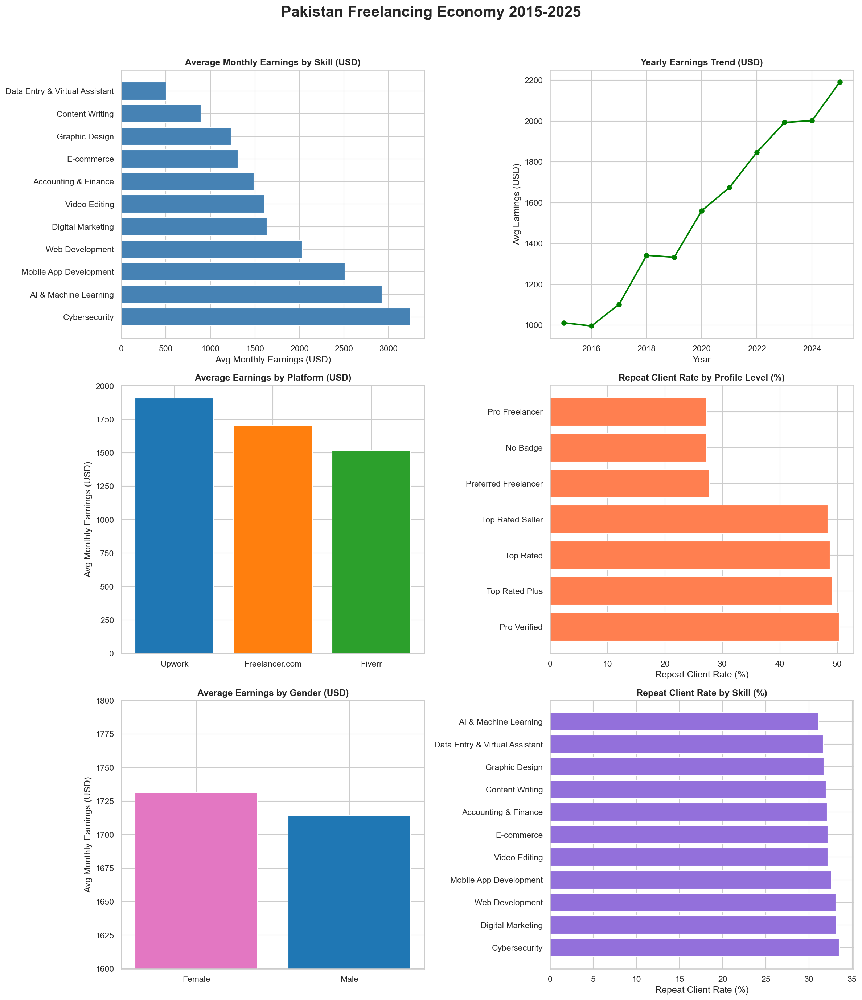

# Pakistan Freelancing Economy Analysis (2015–2025)

A complete data analytics and visualization project exploring the growth of Pakistan’s freelancing economy from 2015 to 2025 using Python, Matplotlib, Pandas, and Power BI.

This project analyzes freelancer earnings, platform performance, repeat client behavior, skills demand, gender-based earnings, and yearly growth trends in Pakistan’s digital economy.

---

# Project Overview

Pakistan has become one of the fastest-growing freelancing economies in the world. This project provides analytical insights into:

- Freelancer earnings trends
- Top-paying freelance skills
- Platform-wise earnings comparison
- Repeat client behavior
- Gender earnings analysis
- Geographic freelancer distribution
- PKR vs USD earning trends

The project combines:
- Python Data Analysis
- Matplotlib Visualizations
- Power BI Dashboards
- Business Intelligence Insights

---

# Dashboard Preview

## Python Matplotlib Dashboard



---

## Power BI Dashboard


---

# Features

- 📊 Data Visualization Dashboard
- 📈 Yearly Earnings Trend Analysis
- 💼 Skill-Based Earnings Comparison
- 🌍 Geographic Distribution Analysis
- 🔁 Repeat Client Rate Insights
- 👨‍💻 Platform Comparison (Upwork, Fiverr, Freelancer.com)
- 👩‍💼 Gender Earnings Analysis
- 💹 PKR vs USD Trend Analysis
- 📍 Power BI Interactive Dashboard
- 🐍 Python Matplotlib Charts

---

# Tech Stack

## Languages & Tools

- Python
- Pandas
- NumPy
- Matplotlib
- Seaborn
- Power BI
- Jupyter Notebook

---

# Dataset Information

The dataset contains freelancing economy data from 2015–2025 including:

- Freelancer earnings
- Skills/categories
- Platforms
- Client retention rates
- Gender distribution
- Review scores
- Geographic data

---

# Key Insights

## 1. Highest Paying Skills

The highest-paying freelance skills are:

- Cybersecurity
- AI & Machine Learning
- Mobile App Development
- Web Development

Lower-paying but highly competitive categories include:

- Data Entry
- Content Writing
- Virtual Assistance

---

## 2. Earnings Growth Trend

Freelancer earnings steadily increased from 2015 to 2025 due to:

- Increased remote work adoption
- Global outsourcing growth
- Expansion of Pakistan’s IT sector
- Digital economy development

---

## 3. Platform Comparison

The analysis compares:

- Upwork
- Fiverr
- Freelancer.com

### Findings

- Upwork freelancers earn higher average income
- Fiverr shows strong repeat client engagement
- Freelancer.com maintains stable participation

---

## 4. Repeat Client Analysis

Freelancers with premium profile badges like:

- Top Rated
- Top Rated Plus
- Pro Verified

show significantly higher repeat client rates.

This indicates:
- Strong profile credibility
- Better client trust
- Higher long-term earning potential

---

## 5. Gender Earnings Analysis

The project compares average earnings between male and female freelancers and highlights growing female participation in Pakistan’s freelancing ecosystem.

---

# Project Structure

```bash
Pakistan-Freelancing-Analysis/
│
├── data/
│   ├── freelancing_dataset.csv
│
├── notebooks/
│   ├── analysis.ipynb
│
├── dashboards/
│   ├── powerbi_dashboard.pbix
│
├── images/
│   ├── pakistan_freelancing_analysis.png
│   ├── powerbi_dashboard.png
│
├── README.md
│
└── requirements.txt
```

---

# Installation & Setup

## 1. Clone Repository

```bash
git clone https://github.com/Tahamallick/pakistan-freelancing-analysis.git
cd pakistan-freelancing-analysis
```

---

## 3. Run Jupyter Notebook

```bash
jupyter notebook
```

---

# Example Analysis Included

## Earnings by Skill

Shows:
- Highest-paying skills
- Technical skill demand
- Market competitiveness

---

## Yearly Earnings Trend

Visualizes freelancer income growth between 2015–2025.

---

## Repeat Client Rate

Analyzes:
- Client retention
- Freelancer credibility
- Platform trust factors

---

## Geographic Analysis

Displays freelancer distribution across Pakistan using map based visualization.

---

# Future Improvements

Planned upgrades include:

- Streamlit Web App
- Machine Learning Predictions
- Real-time API Integration
- SQL Database Support
- AI_-based Skill Recommendations
- NLP Review Analysis

---

# Contributing

Contributions are welcome.

Steps:
1. Fork the repository
2. Create a new branch
3. Commit your changes
4. Push to GitHub
5. Open a Pull Request

---

# Author

## Taha Mallick

- GitHub: https://github.com/Tahamallick
- Repository: https://github.com/Tahamallick/pakistan-freelancing-analysis

---

# Support

If you found this project useful:

Star the repository  
Fork the project  
Share with others

---
